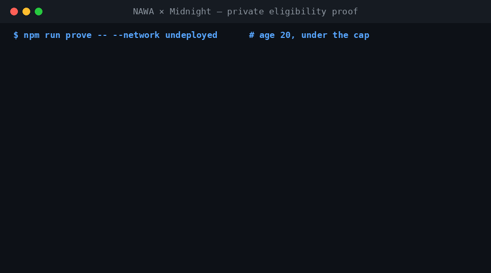

# Demo — verified run

Captured from a live run on the local Midnight devnet
(node + indexer + proof-server via `docker-compose.yml`). Every case below is
real output from `prove-eligibility.ts`, which deploys a fresh eligibility
contract and then proves against it.



Reproduce with:

```bash
npm install
npm run compile:eligibility
docker compose up -d proof-server
# then the four commands below
```

---

## Case 1 — Eligible (age 20, funding 0)

```
MIN_AGE=18 MAX_FUNDING=100000 AGE=20 FUNDING=0 npm run prove -- --network undeployed
```

```
  Public criteria (on-chain):   minAge = 18, maxPriorFunding = 100000
  Private witnesses (never sent): age = 20, priorFunding = 0
  Deploying eligibility contract (sets public criteria)...
  Contract: 460870b0c700a9026ad4c2231d1ab13329ee5c9241b0a4d68633c5b7a568a2d5
  Generating eligibility proof (proof server)...
  ✅ ELIGIBLE — proof verified. The chain accepted the tx without ever
     seeing the applicant's age or funding.
     Proof reference (for NAWA audit log):
     460870b0c700a9026ad4c2231d1ab13329ee5c9241b0a4d68633c5b7a568a2d5@005aa3a817d8e0c5e0b6a081c0dde017f5a1fbed9afc1c04a162a82e2f35024ba5
```

The `<contractAddress>@<txId>` reference is what NAWA's intake would store in its
audit log — a verifiable record that the applicant cleared the bar, with none of
the underlying personal data.

## Case 2 — Replay guard (same secret, proven twice)

```
MIN_AGE=18 MAX_FUNDING=100000 AGE=20 FUNDING=0 REPLAY=1 npm run prove -- --network undeployed
```

```
  ── Replay: proving AGAIN with the SAME secret ──
  ✅ REPLAY BLOCKED — the second proof was correctly rejected.
     (reason: eligibility already proven for this applicant)
```

The nullifier derived from the applicant's secret was already spent, so a second
proof from the same applicant is refused — one applicant, one eligibility proof.

## Case 3 — Underage (age 16)

```
MIN_AGE=18 MAX_FUNDING=100000 AGE=16 FUNDING=0 npm run prove -- --network undeployed
```

```
  Public criteria (on-chain):   minAge = 18, maxPriorFunding = 100000
  Private witnesses (never sent): age = 16, priorFunding = 0
  Contract: 812dbeb9855c54d1f5eddb1292bc81695ef112b78e6b1925573c03024e9ef35e
  ⛔ INELIGIBLE — no valid proof could be produced.
     (reason: applicant below minimum age)
```

## Case 4 — Over the prior-funding cap (funding 200000)

```
MIN_AGE=18 MAX_FUNDING=100000 AGE=20 FUNDING=200000 npm run prove -- --network undeployed
```

```
  Public criteria (on-chain):   minAge = 18, maxPriorFunding = 100000
  Private witnesses (never sent): age = 20, priorFunding = 200000
  Contract: dbb5adab302f29f37057520f56f156ecf558a6e23827f433a246fa8140f17649
  ⛔ INELIGIBLE — no valid proof could be produced.
     (reason: applicant exceeds prior-funding cap)
```

---

## Summary

| Case | Inputs | Outcome |
| --- | --- | --- |
| Eligible | age 20, fund 0 | ✅ proof verified |
| Replay | same secret ×2 | ✅ second proof blocked on the nullifier |
| Underage | age 16 | ⛔ below minimum age |
| Over cap | fund 200000 | ⛔ exceeds prior-funding cap |

For the two ineligible cases, no proof can be constructed at all — the failing
`assert` inside the circuit means there is no witness that satisfies the rules,
so there is nothing to verify. Ineligibility leaks nothing beyond "the rule that
failed".
